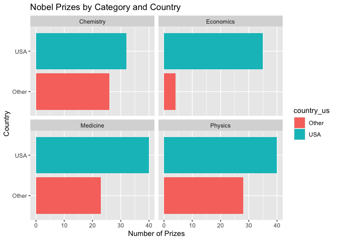

Lab 03 - Nobel laureates
================
Allison Li
01/29/25

### Load packages and data

``` r
library(tidyverse) 
```

``` r
nobel <- read_csv("data/nobel.csv")
```

### Exercise 1.1

``` r
as_tibble(nobel)
```

    ## # A tibble: 935 × 26
    ##       id firstname   surname  year category affiliation city  country born_date 
    ##    <dbl> <chr>       <chr>   <dbl> <chr>    <chr>       <chr> <chr>   <date>    
    ##  1     1 Wilhelm Co… Röntgen  1901 Physics  Munich Uni… Muni… Germany 1845-03-27
    ##  2     2 Hendrik A.  Lorentz  1902 Physics  Leiden Uni… Leid… Nether… 1853-07-18
    ##  3     3 Pieter      Zeeman   1902 Physics  Amsterdam … Amst… Nether… 1865-05-25
    ##  4     4 Henri       Becque…  1903 Physics  École Poly… Paris France  1852-12-15
    ##  5     5 Pierre      Curie    1903 Physics  École muni… Paris France  1859-05-15
    ##  6     6 Marie       Curie    1903 Physics  <NA>        <NA>  <NA>    1867-11-07
    ##  7     6 Marie       Curie    1911 Chemist… Sorbonne U… Paris France  1867-11-07
    ##  8     8 Lord        Raylei…  1904 Physics  Royal Inst… Lond… United… 1842-11-12
    ##  9     9 Philipp     Lenard   1905 Physics  Kiel Unive… Kiel  Germany 1862-06-07
    ## 10    10 J.J.        Thomson  1906 Physics  University… Camb… United… 1856-12-18
    ## # ℹ 925 more rows
    ## # ℹ 17 more variables: died_date <date>, gender <chr>, born_city <chr>,
    ## #   born_country <chr>, born_country_code <chr>, died_city <chr>,
    ## #   died_country <chr>, died_country_code <chr>, overall_motivation <chr>,
    ## #   share <dbl>, motivation <chr>, born_country_original <chr>,
    ## #   born_city_original <chr>, died_country_original <chr>,
    ## #   died_city_original <chr>, city_original <chr>, country_original <chr>

``` r
print(nobel)
```

    ## # A tibble: 935 × 26
    ##       id firstname   surname  year category affiliation city  country born_date 
    ##    <dbl> <chr>       <chr>   <dbl> <chr>    <chr>       <chr> <chr>   <date>    
    ##  1     1 Wilhelm Co… Röntgen  1901 Physics  Munich Uni… Muni… Germany 1845-03-27
    ##  2     2 Hendrik A.  Lorentz  1902 Physics  Leiden Uni… Leid… Nether… 1853-07-18
    ##  3     3 Pieter      Zeeman   1902 Physics  Amsterdam … Amst… Nether… 1865-05-25
    ##  4     4 Henri       Becque…  1903 Physics  École Poly… Paris France  1852-12-15
    ##  5     5 Pierre      Curie    1903 Physics  École muni… Paris France  1859-05-15
    ##  6     6 Marie       Curie    1903 Physics  <NA>        <NA>  <NA>    1867-11-07
    ##  7     6 Marie       Curie    1911 Chemist… Sorbonne U… Paris France  1867-11-07
    ##  8     8 Lord        Raylei…  1904 Physics  Royal Inst… Lond… United… 1842-11-12
    ##  9     9 Philipp     Lenard   1905 Physics  Kiel Unive… Kiel  Germany 1862-06-07
    ## 10    10 J.J.        Thomson  1906 Physics  University… Camb… United… 1856-12-18
    ## # ℹ 925 more rows
    ## # ℹ 17 more variables: died_date <date>, gender <chr>, born_city <chr>,
    ## #   born_country <chr>, born_country_code <chr>, died_city <chr>,
    ## #   died_country <chr>, died_country_code <chr>, overall_motivation <chr>,
    ## #   share <dbl>, motivation <chr>, born_country_original <chr>,
    ## #   born_city_original <chr>, died_country_original <chr>,
    ## #   died_city_original <chr>, city_original <chr>, country_original <chr>

There are 935 observations and 26 variables in the dataset. Each row in
the nobel dataset represents a Nobel Prize winner. That row includes all
the information about the person, such as name, year of winning, and the
category of the prize in each column.

### Exercise 1.2 Create a new data frame called nobel_living

``` r
nobel_living <- filter(nobel,  is.na(died_date), !is.na(country), gender != "org")
nobel_living
```

    ## # A tibble: 228 × 26
    ##       id firstname   surname  year category affiliation city  country born_date 
    ##    <dbl> <chr>       <chr>   <dbl> <chr>    <chr>       <chr> <chr>   <date>    
    ##  1    68 Chen Ning   Yang     1957 Physics  Institute … Prin… USA     1922-09-22
    ##  2    69 Tsung-Dao   Lee      1957 Physics  Columbia U… New … USA     1926-11-24
    ##  3    95 Leon N.     Cooper   1972 Physics  Brown Univ… Prov… USA     1930-02-28
    ##  4    97 Leo         Esaki    1973 Physics  IBM Thomas… York… USA     1925-03-12
    ##  5    98 Ivar        Giaever  1973 Physics  General El… Sche… USA     1929-04-05
    ##  6    99 Brian D.    Joseph…  1973 Physics  University… Camb… United… 1940-01-04
    ##  7   101 Antony      Hewish   1974 Physics  University… Camb… United… 1924-05-11
    ##  8   103 Ben R.      Mottel…  1975 Physics  Nordita     Cope… Denmark 1926-07-09
    ##  9   106 Samuel C.C. Ting     1976 Physics  Massachuse… Camb… USA     1936-01-27
    ## 10   107 Philip W.   Anders…  1977 Physics  Bell Telep… Murr… USA     1923-12-13
    ## # ℹ 218 more rows
    ## # ℹ 17 more variables: died_date <date>, gender <chr>, born_city <chr>,
    ## #   born_country <chr>, born_country_code <chr>, died_city <chr>,
    ## #   died_country <chr>, died_country_code <chr>, overall_motivation <chr>,
    ## #   share <dbl>, motivation <chr>, born_country_original <chr>,
    ## #   born_city_original <chr>, died_country_original <chr>,
    ## #   died_city_original <chr>, city_original <chr>, country_original <chr>

There are 228 observations.

### Exercise 2

``` r
nobel_living <- nobel_living %>%
  mutate(
    country_us = if_else(country == "USA", "USA", "Other")
  )

nobel_living_science <- nobel_living %>%
  filter(category %in% c("Physics", "Medicine", "Chemistry", "Economics"))
print(nobel_living_science)
```

    ## # A tibble: 228 × 27
    ##       id firstname   surname  year category affiliation city  country born_date 
    ##    <dbl> <chr>       <chr>   <dbl> <chr>    <chr>       <chr> <chr>   <date>    
    ##  1    68 Chen Ning   Yang     1957 Physics  Institute … Prin… USA     1922-09-22
    ##  2    69 Tsung-Dao   Lee      1957 Physics  Columbia U… New … USA     1926-11-24
    ##  3    95 Leon N.     Cooper   1972 Physics  Brown Univ… Prov… USA     1930-02-28
    ##  4    97 Leo         Esaki    1973 Physics  IBM Thomas… York… USA     1925-03-12
    ##  5    98 Ivar        Giaever  1973 Physics  General El… Sche… USA     1929-04-05
    ##  6    99 Brian D.    Joseph…  1973 Physics  University… Camb… United… 1940-01-04
    ##  7   101 Antony      Hewish   1974 Physics  University… Camb… United… 1924-05-11
    ##  8   103 Ben R.      Mottel…  1975 Physics  Nordita     Cope… Denmark 1926-07-09
    ##  9   106 Samuel C.C. Ting     1976 Physics  Massachuse… Camb… USA     1936-01-27
    ## 10   107 Philip W.   Anders…  1977 Physics  Bell Telep… Murr… USA     1923-12-13
    ## # ℹ 218 more rows
    ## # ℹ 18 more variables: died_date <date>, gender <chr>, born_city <chr>,
    ## #   born_country <chr>, born_country_code <chr>, died_city <chr>,
    ## #   died_country <chr>, died_country_code <chr>, overall_motivation <chr>,
    ## #   share <dbl>, motivation <chr>, born_country_original <chr>,
    ## #   born_city_original <chr>, died_country_original <chr>,
    ## #   died_city_original <chr>, city_original <chr>, country_original <chr>, …

### Exercise 3

``` r
library(ggplot2)

ggplot(nobel_living_science, aes(x = country_us, fill = country_us)) +
  geom_bar() + 
  coord_flip() +
  facet_wrap(~ category) +
  labs(title = "Nobel Prizes by Category and Country",
       x = "Country", y = "Number of Prizes") 
```

<!-- -->

According to the plot graphs, the data supported the Buzzfeed’s claim
that most living Nobel laureates were based in the US when they won
their prizes. For all four types of prizes, most of the living nobel
laureates won their prizes when they are in USA.

### Exercise 4

``` r
nobel_living_science <- nobel_living %>%
  mutate(
    country_us = if_else(country == "USA", "USA", "Other") 
  )

nobel_living_science %>%
  count(country_us)
```

    ## # A tibble: 2 × 2
    ##   country_us     n
    ##   <chr>      <int>
    ## 1 Other         81
    ## 2 USA          147

In total, 147 of the winners are born in the USA. \### Exercise 5

``` r
nobel_living_science <- nobel_living %>%
  mutate(
    born_us = if_else(born_country == "USA", "USA", "Other") 
  )%>%
  mutate(
    country_us = if_else(country == "USA", "USA", "Other") 
  )

ggplot(nobel_living_science, aes(x = country_us, fill = born_us)) +
  geom_bar() +  
  coord_flip() +
  facet_wrap(~ category) +  
  labs(title = "Nobel Prizes by Category, Award Country, and Birth country",
       x = "Country", 
       y = "Number of Prizes",
       fill = "Born in US"
  )
```

<!-- -->

According to the graphs, although most of the living nobel laureates are
based in the US when they won the prizes, most of them in general were
not born in the USA.

### Exercise 6

``` r
nobel_living_country <- nobel_living %>%
  filter(!born_country == "USA") %>%
  filter(country == "USA") %>%
  count(born_country) %>%
  arrange(desc(n))
```

According to the table, United Kingdom and Germany are the most common
in having living nobel laureates whom were born outside the USA but won
the prizes within the USA.
